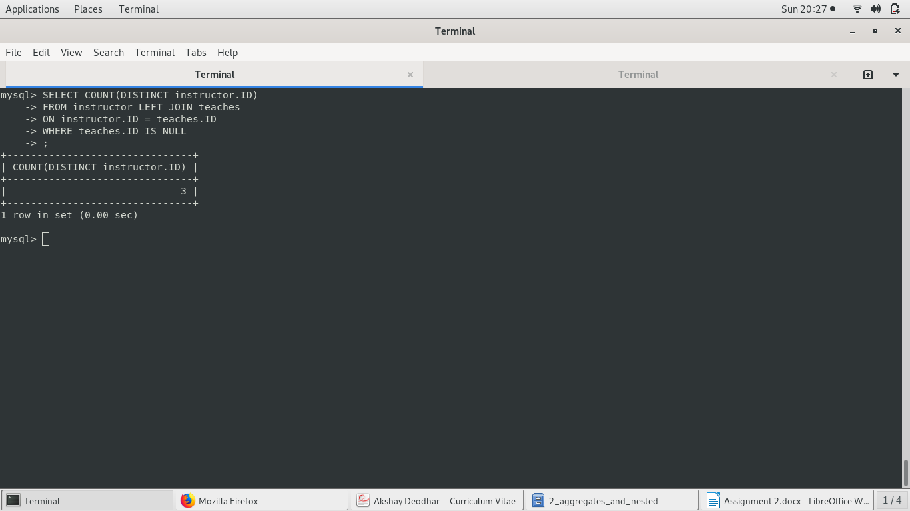
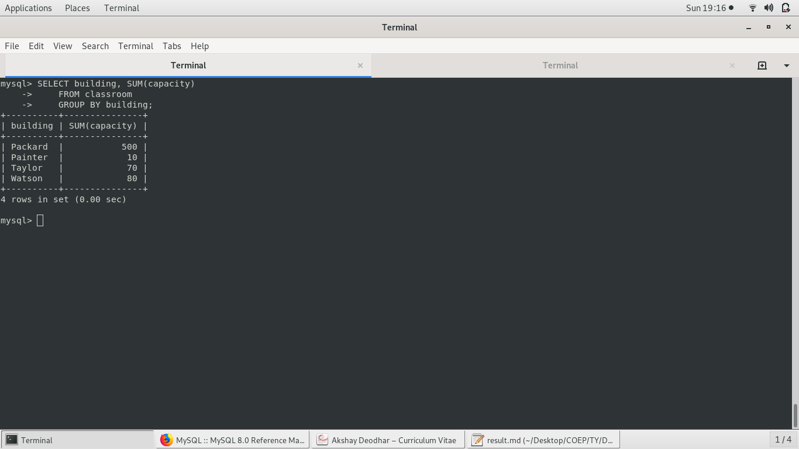
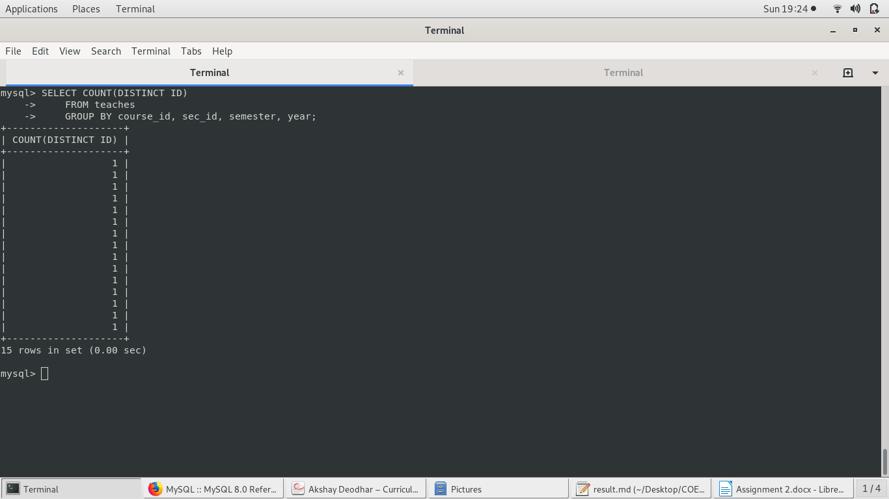

# Assignment 2: Aggregates and Nested Subqueries

## A: Aggregates and Grouping and Ordering:

#### 1 Find the number of instructors who have never taught any course. If the result of your query is empty, add the appropriate data (and include corresponding insert statements) to ensure the result is not empty.
  

	SELECT COUNT(DISTINCT instructor.ID)
	FROM instructor LEFT JOIN teaches
	ON instructor.ID = teaches.ID
	WHERE teaches.ID IS NULL

Result:

\ 

#### 2 Find the total capacity of every building in the university.
  

	SELECT building, SUM(capacity)
	FROM classroom
	GROUP BY building;

\ 

#### 3 Find the maximum number of teachers for any single course section.  Your output should be a single number.  For example, if CS-101 section 1 in Spring 2012 had 3 instructors teaching the course, and no other section had more instructors teaching the section, your answer would be 3.

  
	SELECT COUNT(DISTINCT ID)
	FROM teaches
	GROUP BY course_id, sec_id, semester, year;

\ 

#### 4 Find all departments that have at least one instructor, and list the names of the departments along with the number of instructors;   order the result in descending order of number of instructors. 
  

	SELECT dept_name, COUNT(ID) as count
	FROM instructor
	GROUP BY dept_name
	HAVING COUNT(ID) > 0
	ORDER BY -count

\ 

 
#### 5 For each student, compute the total credits they have successfully completed, i.e. total credits of courses they have taken, for which they have a non-null grade other than 'F'. Do NOT use the tot_creids attribute of student.

	SELECT s.name, SUM(c.credits)
	FROM student as s INNER JOIN takes as t INNER JOIN course as c
	ON s.ID = t.ID AND t.course_id = c.course_id
	WHERE NOT(t.grade IS NULL) AND NOT(t.grade = 'F')
	GROUP BY s.name; 
 
 
\ 

#### 6 Find the number of students who have been taught (at any time) by an instructor named 'Srinivasan'. Make sure you count a student only once even if the student has taken more than one course from Srinivasan.

	SELECT COUNT(DISTINCT t.ID) as students_taught
	FROM takes as t INNER JOIN teaches as ch INNER JOIN instructor as i
	ON (t.course_id, t.sec_id, t.semester, t.year) = 
           (ch.course_id, ch.sec_id, ch.semester, ch.year) AND i.ID = ch.ID
	WHERE i.name = "Srinivasan";

\ 

## Optional

#### 7 Find the name of all instructors who get the highest salary in their department.

	SELECT i.name
	FROM instructor i
	WHERE i.salary = (SELECT MAX(t.salary)
	                  FROM instructor t
	                  WHERE t.dept_name = i.dept_name);

\ 

#### 8 Find all students who have taken all courses taken by instructor 'Srinivasan'. (This is the division operation of relational algebra.) You can implement it by counting the number of courses taught by Srinivasan, and for each student (i.e. group by student), find the number of courses taken by that student, which were taught by Srinivasan. Make sure to count each course ID only once.

	SELECT s.name
	FROM student AS s INNER JOIN takes AS t INNER JOIN teaches AS ch INNER JOIN instructor AS i
	ON s.ID = t.ID AND (t.course_id, t.sec_id, t.semester, t.year) = 
                           (ch.course_id, ch.sec_id, ch.semester, ch.year) AND ch.ID = i.ID
	WHERE i.name = "Srinivasan"
	GROUP BY s.ID
	HAVING COUNT(DISTINCT t.course_id) = 
	(SELECT COUNT(DISTINCT course_id)
	 FROM teaches as t INNER JOIN instructor as i
	 ON t.ID = i.ID
	 WHERE i.name = "Srinivasan");

\ 

#### 9 Find the total money spent by each department for salaries of instructors of that department.

	SELECT dept_name, SUM(salary)
	FROM instructor
	GROUP BY dept_name;

\ 

#### 10 Find the names of all students whose advisor has taught the maximum number of courses (multiple offerings of a course count as only 1).
(Note: this is a complex query, break it into parts by using the with clause.)

The maximum number of courses

	WITH instructor_workload AS
	(SELECT ID, COUNT(DISTINCT course_id) as no_of_courses
	 FROM teaches
	 GROUP BY ID)
	SELECT s.name
	FROM student AS s INNER JOIN advisor AS a 
             INNER JOIN instructor_workload AS i
	ON s.ID = a.s_ID AND a.i_ID = i.ID
	WHERE i.no_of_courses = 
              (SELECT MAX(no_of_courses) FROM instructor_workload);

\ 

## Nested Subqueries: Write the following queries for university schema. 

#### 11 Find the id and title of all courses which do not require any  prerequisites.

	SELECT c.course_id, c.title
	FROM prereq as p RIGHT JOIN course as c
	ON p.course_id = c.course_id
	WHERE p.prereq_id IS NULL;

\ 

* Who said we need nested subqueries? Long live RIGHT JOIN

#### 12 Find the names of students who have not taken any biology dept. courses.

	SELECT DISTINCT s.name
	FROM student as s INNER JOIN takes as t RIGHT JOIN 
             (SELECT * FROM course WHERE NOT(dept_name = "Biology")) as c
	ON s.ID = t.ID AND t.course_id = c.course_id
	WHERE NOT(c.course_id IS NULL); 

\ 

